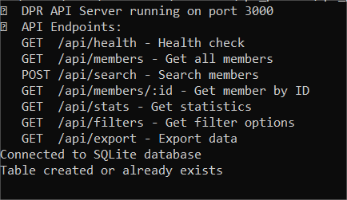
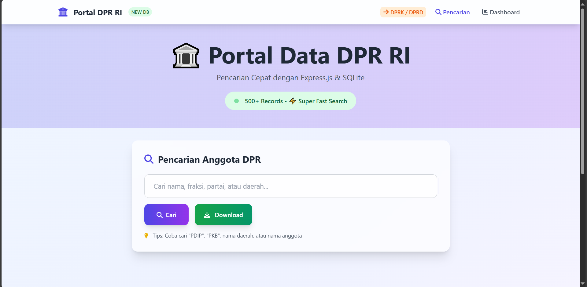
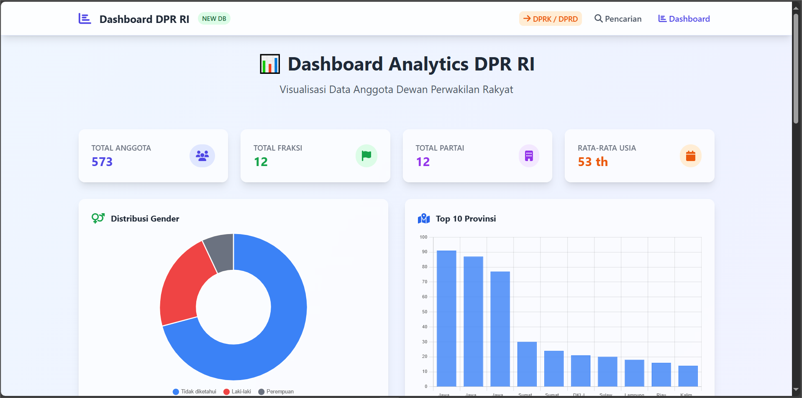
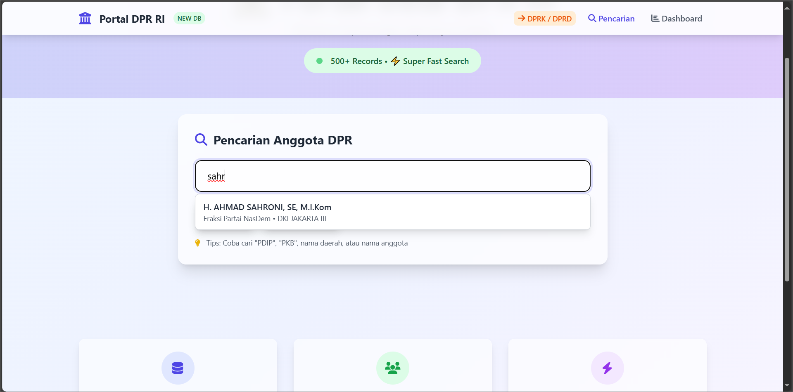
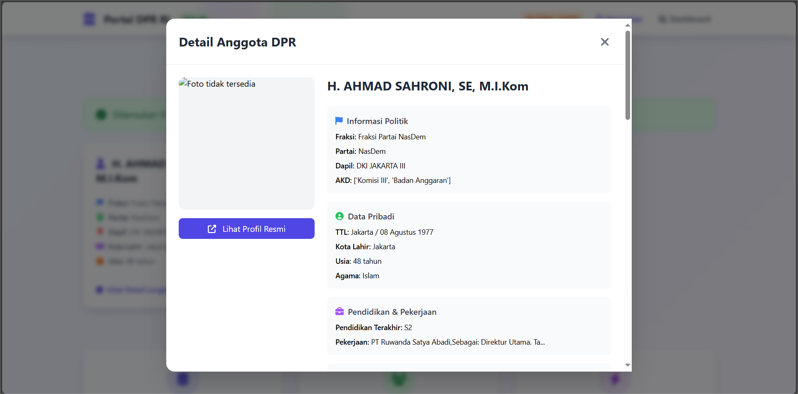
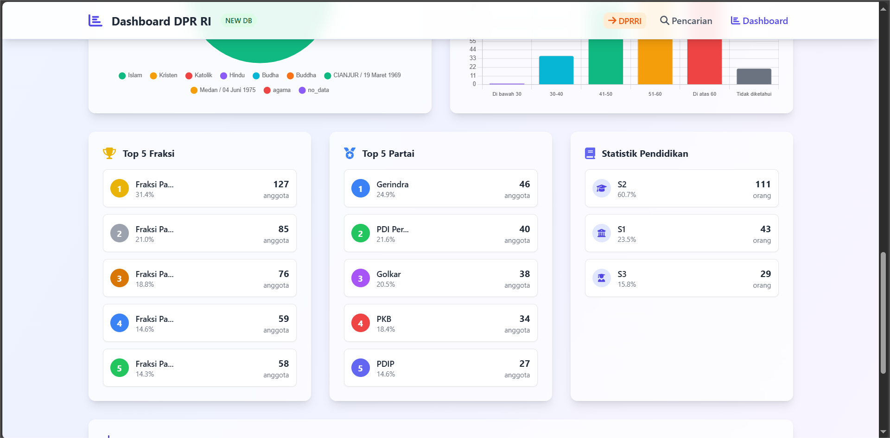
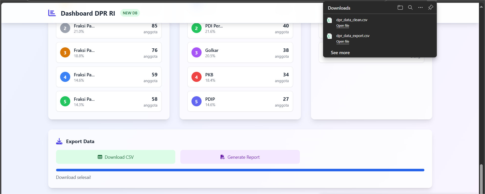

# 🏛️ Portal Data DPR RI (Express.js + SQLite)

Aplikasi ini adalah portal data anggota DPR RI berbasis **Express.js** dengan **SQLite**.  
Frontend dibangun dengan Tailwind CSS, sedangkan backend menggunakan API Express.js yang cepat dan ringan.

⚠️ **Disclaimer:**  
Data anggota DPR RI yang digunakan di sini **berasal dari hasil leak / data farm** yang tersebar di internet.  
Data ini **bisa valid** atau **sudah tidak valid**.  
Proyek ini **dibuat semata-mata untuk pembelajaran developer**, **bukan untuk tujuan komersial atau penyalahgunaan data pribadi**.

---

## 📂 Struktur Folder
```
.
├── public/
│   ├── index.html
│   ├── dashboard.html
├── server.js
├── package.json
├── render.yaml
├── dpr_data.db            # Database SQLite siap pakai
├── dpr_data_clean.csv     # Data mentah (hasil leak/farm)
```

---

## 🚀 Menjalankan Secara Lokal

### 1. Clone repository
```bash
git clone https://github.com/dandidandil123/prtl-dprri.git
cd prtl-dprri
```

### 2. Install dependencies
Pastikan sudah terinstall Node.js & npm/yarn.
```bash
npm install
# atau
yarn install
```

### 3. Jalankan server
```bash
node server.js
```

Server akan berjalan di `http://localhost:3000`.

### 4. Akses aplikasi
Buka browser ke `http://localhost:3000` untuk melihat frontend.  
API tersedia di `http://localhost:3000/api/...`

---

## 📸 Screenshots Aplikasi

### 1. Terminal Startup


### 2. Homepage - Landing Page


### 3. Dashboard - Analytics Data DPR RI


### 4. Result Search - Hasil Pencarian


### 5. Detail Anggota DPR RI


### 6. Statistics Page


### 10. Export Data CSV



---

## ☁️ Deploy ke Render

1. Buat akun di [Render](https://render.com).
2. Buat **New Web Service**.
3. Hubungkan ke repository GitHub Anda.
4. Pilih branch (misalnya `main`).
5. Pada bagian **Environment**:
   - `Build Command`: `npm install`
   - `Start Command`: `node server.js`
6. Render otomatis membaca file `render.yaml` jika ada, sehingga setting lebih mudah.

Setelah deploy, aplikasi bisa diakses di URL Render yang diberikan, misalnya `https://nama-project.onrender.com`.

---

## 🔗 API Endpoints

- `GET /api/health` -- Cek kesehatan server
- `GET /api/members` -- Ambil semua anggota DPR
- `POST /api/search` -- Cari anggota DPR (dengan pagination & filter)
- `GET /api/members/:id` -- Ambil detail anggota DPR by ID
- `GET /api/stats` -- Statistik anggota DPR
- `GET /api/filters` -- Opsi filter (fraksi, partai, agama, dll.)
- `GET /api/export?format=csv` -- Ekspor data ke CSV

---

## ⚠️ Catatan Penting

- Data bersifat publik/leak & tidak ada jaminan keakuratan.
- Proyek ini **hanya untuk pembelajaran developer**.

---

© 2025 Portal Data DPR RI -- Express.js Version
